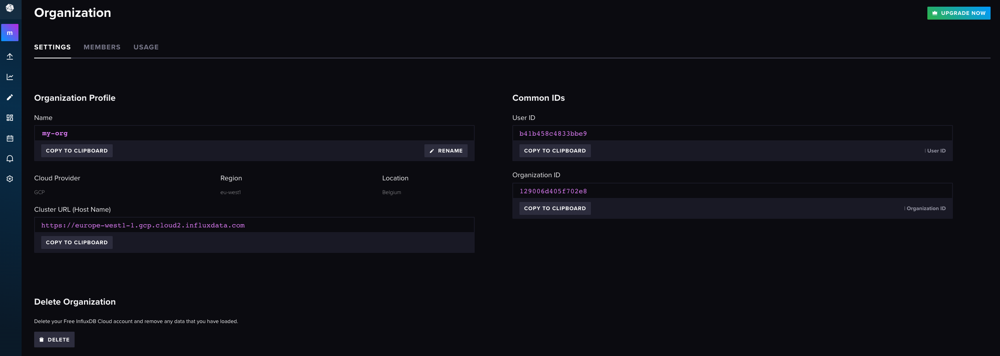
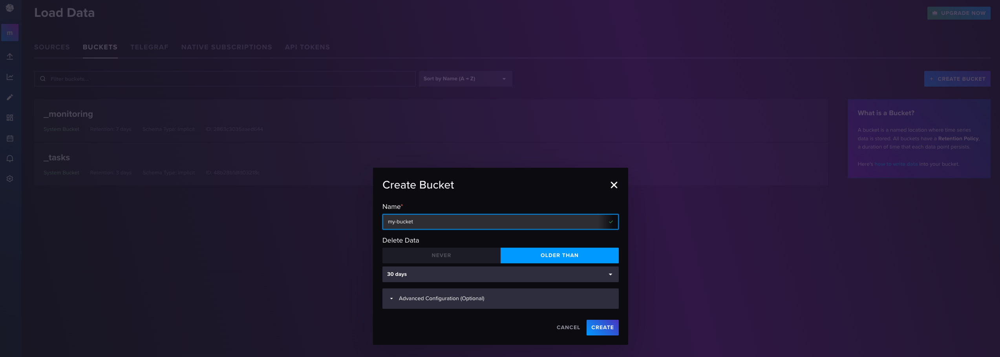
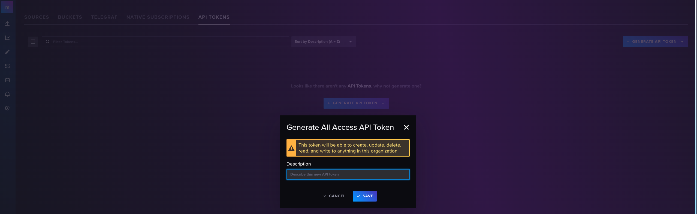
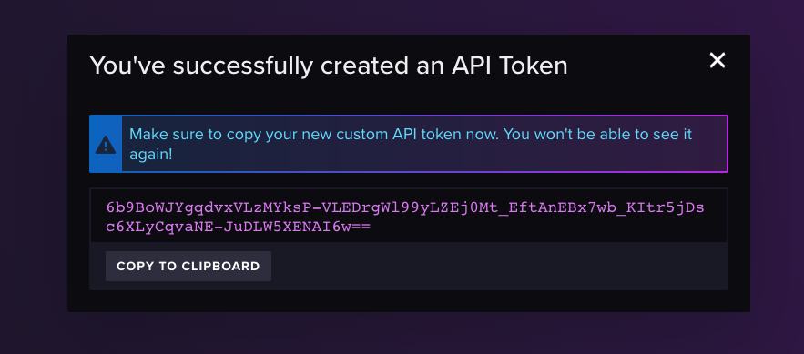

# ParameterizedQuery

This is an example how to query with query parameters in InfluxDB Cloud (no support in InfluxDB OSS).

## Prerequisites:
- Cloned examples:
   ```bash
   git clone git@github.com:influxdata/influxdb-client-swift.git
   cd Examples/ParameterizedQuery
   ```

## Sources:
- [Package.swift](/Examples/ParameterizedQuery/Package.swift)
- [ParameterizedQuery.swift](/Examples/ParameterizedQuery/Sources/ParameterizedQuery/ParameterizedQuery.swift)

## How to test:
1. Start [InfluxDB cloud](https://cloud2.influxdata.com/)


2. Get Url and Organization name - @url, @org



3. Create bucket - @bucketName



4. Generate API token - @apiToken





5. Execute Query by:
   ```bash
   swift run parameterized-query --org @org --bucket @bucketName --token @apiToken --url @url
   ```
   
## Expected output

```bash
Query to execute:

from(bucket: params.bucketParam)
    |> range(start: -10m)
    |> filter(fn: (r) => r["_measurement"] == params.measurement)

["measurement": "demo", "bucketParam": "my-bucket"]

Success response...

 > value: 1
 > value: 2
 > value: 3
```